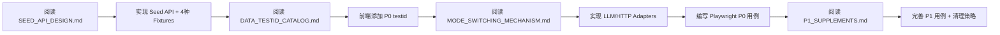

# 真实用户体验自动化测试规划（Playwright + 全链路真实场景）

> 目标：用“真实用户操作流程”验证 PRD MVP 主链路的**可用性、可观测性、可控性、可复现性**；同时允许在可控前提下逐步升级到“全链路真实（含 LLM/外部依赖）”。
>
> 核心原则（KISS / Fail-Closed / 可追溯）：
> - **同一套用户用例**在不同环境复用；差异只体现在“数据准备/依赖注入”，而不是改变用户动作与 UX 断言。
> - UI 自动化（Playwright）与全链路真实并不冲突：前者用于稳定回归，后者用于真实波动/集成风险的早发现（通常 nightly）。

---

## 1. 范围与验收口径（以 PRD 为事实源）

### 1.1 P0（必须覆盖：真实用户旅程闭环）
用户从“进入系统”到“看到可解释的成功/失败”必须形成闭环：
1) 进入首页创建工作流（或打开已有工作流编辑器）
2) 编辑画布（拖拽/连线/改配置）并保存
3) 点击 RUN（会创建 run_id）
4) 通过 SSE 看到执行进度与节点级状态
5) 若存在外部副作用：弹窗确认 allow/deny（默认 deny）
6) 终态：`workflow_complete` 或 `workflow_error`（禁止静默失败）
7) 能回放 run 事件（Replay）或下载执行产物（如有）

### 1.2 P1（重要：PRD 关键约束/防御）
- **只改 start→end 主连通子图**：对话修改的输入裁剪 + 落地拒绝越界修改（双层防御）。
- **Fail-Closed**：工具不存在/参数不合法/被 Coordinator 拒绝 → 必须显式报错。
- **ReAct 停止条件**：达到上限必须退出并报告原因（防止循环失控）。

### 1.3 非目标（避免过度工程化，YAGNI）
- 不追求在 UI E2E 中覆盖所有节点类型/所有工具能力。
- 不在 CI 中强制依赖真实 LLM/真实外部 API（不可复现，易 flaky）。

---

## 2. 系统与契约（用于定位失败归因）

### 2.1 前端关键入口（用户可感知）
- 路由：`/` 与 `/workflows/:id/edit`
- 创建：`POST /api/workflows/chat-create/stream`（SSE；早期事件必须含 `metadata.workflow_id`）
- 修改：`POST /api/workflows/{workflow_id}/chat-stream`（SSE planning channel）
- 保存：`PATCH /api/workflows/{workflow_id}`
- 运行：
  - 创建 run：`POST /api/projects/{project_id}/workflows/{workflow_id}/runs`
  - 执行（SSE execution channel）：`POST /api/workflows/{workflow_id}/execute/stream`（要求 `run_id`）
- 回放：`GET /api/runs/{run_id}/events?channel=execution`
- 副作用确认：`POST /api/runs/{run_id}/confirm`（allow/deny）

### 2.2 后端关键机制（用户体验稳定性的根因）
- PRD-030：执行流若检测到副作用节点，会先发 `workflow_confirm_required`，并等待确认结果；超时/取消默认 deny（fail-closed）。
- ReAct：执行失败后进入修复循环（有 max attempts / max time / max llm calls / consecutive failures）。
- 主连通子图：对话修改仅对主子图生效；越界修改会被拒绝（DomainValidationError）。

---

## 3. 分层测试策略（把“真实体验”拆成可控验证）

### 3.1 层级与目的（推荐顺序：先稳后真）
1) **Unit / Component（已有）**：纯函数/Hook/组件逻辑（快、确定）
2) **Integration / Contract（已有）**：API 契约、SSE 解析、执行内核不变式（快、较确定）
3) **UI E2E（Playwright，新增）**：真实用户操作 + 真实前端渲染 + 真实后端（但外部依赖受控）
4) **Full-real E2E（nightly）**：真实用户操作 + 真实后端 + 真实 LLM/外部调用（少量用例，专门抓集成风险）

> SOLID 映射：把“可复现性”责任放在测试夹具/依赖注入层，不侵入业务代码；把“真实体验”断言留给 UI 层。

---

## 4. 环境矩阵（同一套用例，三种运行模式）

| 模式 | UI | 后端 API | DB | LLM | 外部 HTTP/工具副作用 | 适用场景 | 预期稳定性 |
|---|---|---|---|---|---|---|---|
| A. Deterministic（CI） | 真实 | 真实 | 每次重置/隔离 | Stub/禁用 | Stub/本地 mock | PR 回归、冒烟 | 高 |
| B. Hybrid（PR/每日） | 真实 | 真实 | 可共享但可清理 | 受控（固定输出/回放） | 受控（mock server） | 集成回归 | 中高 |
| C. Full-real（nightly） | 真实 | 真实 | 隔离环境 | 真实 | 真实（但仍默认确认） | 真实波动/供应商变更 | 中低（可接受） |

关键点（KISS）：
- A/B 的目标是“证明系统 UX 不回归”，而不是“证明 LLM 永远正确”。
- C 的目标是“尽早发现真实世界会坏在哪里”，失败要能归因与回放。

---

## 5. 用例清单（P0/P1/P2）——真实用户动作 + 可定位断言

> 用例命名规则：`UX-<领域>-<编号>`；每条用例都必须产出“诊断线索”（截图/控制台日志/关键请求响应/后端 run_id）。

### 5.1 P0：UX 主链路 Smoke（所有模式都跑，A/B 必须稳定）

**UX-WF-001 打开编辑器并加载工作流**
- 前置：准备一个已有 `workflow_id`（A/B 用 seed；C 可通过 chat-create 创建）。
- 用户动作：打开 `/workflows/{id}/edit`。
- 断言：
  - 页面不出现“工作流加载失败”。
  - 画布出现 start/end（或至少节点数 > 0）。
- 失败归因：
  - 404/加载失败：后端 `GET /workflows/{id}`、DB 数据、前端 `useWorkflow`。

**UX-WF-002 保存工作流成功**
- 用户动作：对节点配置做一次可见修改 → 点击保存。
- 断言：
  - 出现“工作流保存成功”提示。
  - 后端 `PATCH /workflows/{id}` 返回 2xx。
- 失败归因：
  - 校验弹窗：后端 `WorkflowSaveValidator`（属于后端校验问题/前端构造 payload 问题）。

**UX-WF-003 运行：创建 Run + SSE 终态可见**
- 前置：URL 包含 `?projectId=...`（或 workflow 本身带 project_id）。
- 用户动作：点击 RUN。
- 断言：
  - 若 run_persistence 开启：出现 run_id（或有 session started 提示）。
  - SSE 事件最终到达 `workflow_complete` 或 `workflow_error`（不得卡死）。
  - 节点状态有可见变化（running/completed/error）。
- 失败归因：
  - 410：`DISABLE_RUN_PERSISTENCE=true`（配置/环境问题）。
  - 400：缺 run_id（前端没创建 run 或没传 run_id）。
  - 卡死：SSE 未终止（后端执行流/前端 SSE 解析/网络代理）。

**UX-WF-004 副作用确认：deny → 明确失败（Fail-Closed）**
- 前置：准备一个会被识别为“副作用”的 workflow（至少包含一个被后端判定为 side effect 的节点类型/工具）。
- 用户动作：点击 RUN → 弹窗出现 → 选择 deny。
- 断言：
  - 出现“已拒绝执行外部副作用”（或等价提示）。
  - SSE 终态为 `workflow_error` 且 error 与 confirm 相关（如 `side_effect_confirm_denied`）。
- 失败归因：
  - 不弹窗：后端未识别 side effect（节点类型/识别逻辑）或前端未处理 `workflow_confirm_required`。
  - 弹窗但 deny 后仍执行：确认 gate/等待逻辑缺陷（高优先级 bug）。

**UX-WF-005 Replay：同一 run_id 可回放 execution 事件**
- 前置：成功拿到 run_id 且服务启用事件落库。
- 用户动作：触发 Replay（或刷新页面后自动读取 lastRunId 并回放）。
- 断言：
  - `GET /runs/{run_id}/events?channel=execution` 返回事件序列。
  - 前端能渲染回放完成提示；关键终态事件存在。
- 失败归因：
  - 无事件：事件录制器未启用/DB 未写入/事务未提交。
  - 事件顺序错乱：持久化分页/排序问题（后端）。

### 5.2 P1：PRD 约束与防御（A/B 必跑；C 选跑）

**UX-WF-101 对话修改仅作用于主连通子图**
- 前置：workflow 同时存在主子图 + 孤立子图（隔离节点/孤立边）。
- 用户动作：在 chat 中请求“修改孤立节点/孤立边”。
- 断言：
  - 后端返回明确拒绝（`workflow_modification_rejected` 类错误），或 UI 显示“仅允许操作主连通子图”。
  - 工作流未被错误修改（孤立节点不应变化）。
- 失败归因：
  - 能改孤立节点：主子图落地拒绝缺失（高优先级 bug）。

**UX-WF-102 保存时校验失败必须可解释（禁止静默）**
- 前置：人为制造无效配置/缺必要字段。
- 用户动作：保存。
- 断言：出现结构化校验错误列表（含 code/path/message）。
- 失败归因：后端校验规则/前端错误展示契约。

### 5.3 P2：真实世界风险探测（主要跑 C；A/B 仅做轻量）

**UX-WF-201 全链路真实：chat-create + chat-stream + execute**
- 目标：发现 LLM 输出/供应商变更导致的结构漂移、schema 不符、工具误用。
- 断言：仍满足 P0 的“可解释失败”底线（失败也必须可定位、可回放）。

**UX-WF-202 ReAct 停止条件生效**
- 前置：构造一个必然失败的执行（例如工具缺失/参数不合法）。
- 断言：达到上限后明确终止并给出 stop_reason/报告。
- 风险：会拉长执行时间；必须加 hard timeout 并限制用例数量。

---

## 6. 数据与夹具（决定 Playwright 稳定性的关键）

### 6.1 统一数据准备策略（推荐）
优先顺序（越靠前越稳定）：
1) **Seed API**（推荐新增：测试专用创建/导入 workflow）→ 得到 workflow_id
2) **DB Seed**（写入 workflow/run/event；测试后清理）
3) **LLM 生成**（仅用于 Full-real；不用于 CI 稳定回归）

### 6.2 `projectId` 处理（避免 UX-WF-003 卡死）
- UI 执行链路需要 `projectId` 才能创建 run。
- 测试用例必须统一约定：打开编辑器时带上 `?projectId=e2e_project`，或确保 workflow 自带 project_id。

### 6.3 副作用用例的确定性
- 需要一个“必触发 confirm 的 workflow”。
- 如果 side effect 识别依赖节点类型/工具分类：应提供一个“显式副作用节点”fixture，避免依赖环境差异。

---

## 7. Playwright 设计要点（防 flaky 清单）

### 7.1 选择器稳定性（必须做，KISS）
- 为关键控件添加 `data-testid`：
  - 创建按钮/输入框
  - 保存按钮
  - RUN 按钮
  - 确认弹窗（allow/deny）
  - Replay 入口
  - 执行终态提示区

### 7.2 等待策略（必须避免“等待时间”而是“等待条件”）
- 等待网络响应：`/api/...` 2xx/4xx 的明确返回。
- 等待 SSE 终态事件：`workflow_complete` 或 `workflow_error`。
- 避免依赖 UI 动画/延迟：统一关闭动画（或增加稳定的 “ready” 标记）。

### 7.3 隔离与清理（否则必互相污染）
- 每条用例独立 workflow_id / run_id（或每条用例重置 DB）。
- 统一收集产物：失败截图 + 前端 console log + 后端日志（建议 run_id 作为关联键）。

---

## 8. 失败归因速查表（“出了问题大概率是哪一部分”）

| 现象（用户看到的） | 可能出问题的层 | 优先排查点（证据） |
|---|---|---|
| 创建后不跳转编辑器 | 后端 chat-create 契约 / 前端解析 | SSE 早期事件是否含 `metadata.workflow_id`；前端提取逻辑 |
| 点击 RUN 提示缺 projectId | 前端路由/状态 | URL 是否带 `?projectId=`；workflow 是否有 project_id |
| RUN 返回 410 | 配置/环境 | `DISABLE_RUN_PERSISTENCE` 开关是否被打开 |
| RUN 一直转圈/无终态 | SSE/执行内核 | SSE 是否持续有事件；是否缺少 `workflow_complete/error`；后端执行是否卡住 |
| 不弹副作用确认弹窗 | 后端识别/前端事件处理 | 是否发出 `workflow_confirm_required`；前端是否监听并触发 Modal |
| deny 后仍继续执行 | 确认 gate 缺陷 | 后端是否真的等待确认结果；是否错误放行（高优先级） |
| 保存失败但无可解释错误 | 后端校验/前端展示 | 后端是否返回结构化 errors；前端是否渲染 Modal 错误列表 |
| Replay 无事件或顺序乱 | 持久化/录制器 | 事件是否落库；分页 cursor/排序是否稳定；run_id 是否正确 |

---

## 9. 落地里程碑（一步一步推进，先稳后真）

**M0：确定性基础（1–2 天）**
- 加 `data-testid`（只覆盖 P0 控件）
- 增加 seed 机制（Seed API 或 DB seed，任选其一，先 KISS）

**M1：Playwright P0 Smoke（1–2 天）**
- 实现 UX-WF-001~005（跑 A 模式）
- 接入 CI（只跑 Deterministic）

**M2：Hybrid 覆盖 P1（1–2 天）**
- 增加 UX-WF-101/102
- 引入本地 mock server 或 stub 外部依赖

**M3：Full-real Nightly（持续演进）**
- 只保留 1–3 条真实用例（UX-WF-201/202），把失败当成“真实世界预警”

---

## 10. 你现在就能做的最小起步（不冲突路线）

1) 先把"UI 真实操作"用 Playwright 固化成 P0 smoke（依赖受控）——保证用户体验不会回归。
2) 同时保留 nightly 全链路真实用例——捕获 LLM/外部依赖波动。
3) 任何失败必须能回放（run_id + events + 终态原因），否则就不算"可测试的产品"。

---

## 11. 补充文档索引（P0/P1 完整实施指南）

### 11.1 现状验证报告（已完成）

**验证范围**：对照本规划文档的假设前提，验证现有代码库的实际状态。

| 验证项 | 状态 | 发现 |
|---|---|---|
| **P0-1: API 端点存在性** | ✅ 已验证 | 所有 7 个关键端点均已实现 |
| **P0-2: SSE 事件命名** | ✅ 已验证 | 事件类型定义一致，前后端匹配 |
| **P0-3: 配置开关机制** | ✅ 已验证 | `disable_run_persistence` 开关存在，事件录制机制完整 |
| **P0-4: 副作用识别** | ✅ 已验证 | `_SIDE_EFFECT_NODE_TYPES` 包含 HTTP/DATABASE/TOOL |

**结论**：本文档假设的所有前提条件均已满足，无阻塞性缺失。

---

### 11.2 P0 补充文档（实施必读）

#### 📄 [SEED_API_DESIGN.md](./SEED_API_DESIGN.md)
**内容**：测试数据准备 API 的完整设计方案
**包含**：
- Seed API 端点设计（`POST /api/test/workflows/seed`）
- 4 种 Fixture 类型定义（`main_subgraph_only` / `with_isolated_nodes` / `side_effect_workflow` / `invalid_config`）
- UseCase + Repository 实现方案
- Pytest + Playwright 集成示例
- 清理端点设计（`DELETE /api/test/workflows/cleanup`）

**实施要点**：
- ✅ 必须添加 `X-Test-Mode: true` 请求头验证
- ✅ 使用 WorkflowFixtureFactory 注册模式管理 fixtures
- ✅ 清理策略推荐使用 Pytest fixture scope="function"

---

#### 📄 [MODE_SWITCHING_MECHANISM.md](./MODE_SWITCHING_MECHANISM.md)
**内容**：三种测试模式（A/B/C）的切换机制设计
**包含**：
- Domain Port 定义（`LLMPort` / `HTTPClientPort`）
- Infrastructure Adapters 实现（Stub/Replay/Real）
- 环境变量配置方案（`.env.test` / `.env.hybrid` / `.env.fullreal`）
- DI 容器（`AdapterFactory`）设计
- CI Pipeline 集成配置

**实施要点**：
- ✅ 必须遵循依赖倒置原则（依赖 Port 而非具体实现）
- ✅ 模式切换通过环境变量 `E2E_TEST_MODE` 控制
- ✅ 业务代码（UseCase）无需修改，仅改注入配置

---

#### 📄 [DATA_TESTID_CATALOG.md](./DATA_TESTID_CATALOG.md)
**内容**：Playwright 选择器的完整 `data-testid` 属性列表
**包含**：
- 60+ 个关键控件的 testid 定义
- 按页面/功能模块分类（编辑器/控制栏/画布/副作用弹窗/回放）
- React 组件改造示例
- Playwright 使用示例

**实施要点**：
- ✅ P0 必须添加：`workflow-run-button` / `workflow-save-button` / `side-effect-confirm-modal` / `confirm-allow-button` / `confirm-deny-button`
- ✅ 命名规范：`{domain}-{element}-{qualifier}` (如 `workflow-node-start`)
- ✅ 动态 ID 使用模板：`workflow-node-{node_id}`

---

### 11.3 P1 补充文档（提升质量）

#### 📄 [P1_SUPPLEMENTS.md](./P1_SUPPLEMENTS.md)
**内容**：P1 级别的测试夹具、清理策略、失败归因和时间估算
**包含**：
- **测试夹具示例**：完整的"主子图+孤立子图" JSON fixture
- **副作用节点定义**：HTTP/DATABASE/TOOL 节点示例 + 识别规则
- **清理策略对比**：Fixture Scope / Transaction Rollback / Cleanup API
- **失败归因补充**：15+ 个前端/性能场景的排查清单
- **调整后时间估算**：保守估算 9-14 天（约 2-3 周）

**实施要点**：
- ✅ 清理策略推荐：Pytest Fixture Scope（灵活性最高）
- ✅ 副作用节点必须包含 `metadata.has_side_effect: true`
- ✅ 时间估算增加缓冲：M0 +1天、M1 +2天、M2 +1天

---

### 11.4 实施顺序建议（关键路径）

**里程碑关联**：
- **M0**（2-3天）：完成 A→D
- **M1**（3-5天）：完成 E→G
- **M2**（2-3天）：完成 H→I

---

### 11.5 验收清单（对照补充文档）

#### P0 验收标准（必须 100% 通过）
- [ ] Seed API 返回 4 种 fixture，每种能成功执行
- [ ] Playwright 能通过 testid 定位所有 P0 控件
- [ ] 模式 A（Deterministic）稳定通过率 ≥ 99%
- [ ] 副作用确认流程：deny → 明确失败（无静默）
- [ ] Replay 能正确回放至少 10 个事件

#### P1 验收标准（应该通过）
- [ ] 主子图约束测试通过（孤立节点修改被拒绝）
- [ ] 保存校验失败返回结构化错误
- [ ] 三种模式（A/B/C）能通过环境变量切换
- [ ] 清理策略能删除测试数据（残留率 < 5%）

---

## 12. 常见问题与解决方案（基于补充文档）

### Q1: Seed API 返回 403 Forbidden？
**A**: 检查是否添加了 `X-Test-Mode: true` 请求头。参见 [SEED_API_DESIGN.md 第 3.4 节](./SEED_API_DESIGN.md#34-路由实现)。

### Q2: Playwright 找不到元素？
**A**: 检查前端是否添加了对应的 `data-testid`。参见 [DATA_TESTID_CATALOG.md](./DATA_TESTID_CATALOG.md)。

### Q3: 模式切换不生效？
**A**: 检查环境变量 `E2E_TEST_MODE` 和 `LLM_ADAPTER` 是否正确设置。参见 [MODE_SWITCHING_MECHANISM.md 第 5.1 节](./MODE_SWITCHING_MECHANISM.md#51-环境变量定义)。

### Q4: 测试数据未清理？
**A**: 确认使用了正确的清理策略。参见 [P1_SUPPLEMENTS.md P1-3 节](./P1_SUPPLEMENTS.md#p1-3-db-seed-清理策略)。

### Q5: 副作用节点未触发确认？
**A**: 检查节点类型是否在 `_SIDE_EFFECT_NODE_TYPES` 中。参见 [P1_SUPPLEMENTS.md P1-2 节](./P1_SUPPLEMENTS.md#p1-2-副作用节点定义示例)。

---

## 13. 更新日志

| 版本 | 日期 | 变更说明 |
|---|---|---|
| v1.0 | 2025-01-XX | Codex 生成初始版本 |
| v2.0 | 2025-01-XX | Claude 审查并补充 P0/P1 完整实施指南 |
|  |  | - 验证所有 API 端点和前提条件 |
|  |  | - 新增 Seed API 设计文档 |
|  |  | - 新增模式切换机制文档 |
|  |  | - 新增 data-testid 目录 |
|  |  | - 新增 P1 补充文档 |
|  |  | - 调整时间估算（9-14 天） |

---

**文档维护者**：Claude Sonnet 4.5 (审查 & 补充)
**原始作者**：Codex (初始规划)
**最后更新**：2025-01-06
