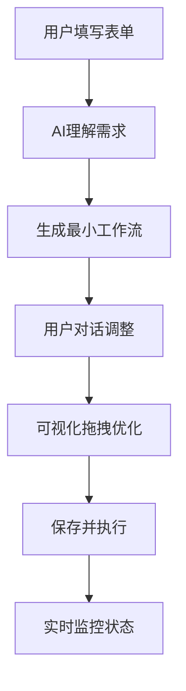

# 项目需求分析

> **项目背景与业务目标参考文档**
>
> 📋 **AI使用说明**：本文档仅用于理解项目背景，具体技术实现请查阅《开发规范》

## 1. 项目概述

### 1.1 项目愿景与定位
本项目旨在成为 Coze 平台的“粘合剂”和小白用户体验的补充型工具，面向个人开发者与入门用户，通过自然语言对话显著降低复杂工作流的设计与实现门槛，帮助用户摆脱繁琐的编码与配置细节，专注于业务逻辑本身。项目定位为智能、高效且高度可视化的个人开发助手：将用户的自然语言描述转化为可执行的任务列表，并以直观流程图在画布呈现，实现从抽象到实现的“所思即所得”；同时在 Coze 与本地/第三方生态之间提供无缝衔接与增强，使对话式 AI 不仅是代码生成器，更是能够理解用户意图、主动沟通与协同工作的智能伙伴。

### 1.2 核心目标：简化个人开发者工作流创建
本项目的核心目标是系统性地简化个人开发者与入门用户创建工作流的复杂过程，降低对框架与 API 的依赖，缩短从构思到执行的路径。我们采用“表格定义 + 对话式 AI 生成 + 可视化画布呈现 + Coze 工作流导入”的交互范式：
1. 用户在结构化表格中填写起点、终点、所需工具与步骤描述；
2. 对话式 AI 解析描述性文本，自动生成结构化的 Task 列表与依赖关系；
3. 将 Task 列表实时渲染为可交互的流程图，支持拖拽调整与属性编辑；
4. 直接导入 Coze 导出的工作流 JSON，快速复用既有逻辑并本地化部署。
整个过程强调低代码甚至无代码的交互，将认知负荷从“如何实现”转移到“要实现什么”，显著提升效率与创造力。

### 1.3 与 Coze 平台的关系：深度绑定与无缝衔接
本项目将与 Coze 深度整合，形成“导入即用、互联互通”的体验：
1. **工作流导入**：支持解析并导入 Coze 导出的工作流 JSON，平滑迁移到本地环境以继续开发与部署；
2. **节点对齐**：对齐 Coze 的节点类型与配置模型，确保用户获得熟悉的操作体验；
3. **API 互通**：打通本项目与 Coze 的 API 生态，在本项目工作流中直接调用 Coze 工具与服务，反向亦可；
4. **能力增强**：在 Coze 能力之外补充小白用户友好流程（表格引导、模板库、可视化优化），提升上手与复用效率。
目标是构建以用户为中心的跨平台开发环境，最大化利用两者优势。

## 🎯 范围与非目标

### 项目范围
- 面向个人开发者与入门用户的工作流构建与执行
- Coze 工作流的导入、复用与本地化增强
- 表格引导 + 对话生成 + 画布拖拽的低门槛交互

### 非目标（当前阶段）
- 复杂多 Agent 协作编排
- 高度可视化的复杂 DAG 调度器与市场生态
- 企业级多租户、计费与高可用网关（后续里程碑再评估）

## 📈 需求演进历程

### v1.0 简单Agent平台 (2024)
```
用户：填写起点+目标 → 系统：创建Agent → 执行：自动完成任务
```
**局限性**：
- 无法看到执行过程
- 无法灵活调整流程
- 缺少可视化反馈

### v2.0 可视化工作流平台 (2025)
```
用户：表单描述需求 → AI：生成工作流 → 用户：对话/拖拽调整 → 执行：可视化监控
```
**改进点**：
- ✅ 表单引导，降低使用门槛
- ✅ 可视化工作流，过程透明
- ✅ 灵活调整，支持对话和拖拽
- ✅ 状态监控，方便调试优化

## 🎯 目标用户群体

### 主要用户
- **个人开发者**：独立/兼职开发者，需要快速拼装与复用工作流
- **入门用户（小白）**：低/零编程基础，倾向表格与对话式操作
- **自动化爱好者**：希望将日常重复任务自动化（数据抓取、通知）
- **小团队非技术成员**：需要简易工具完成跨系统整合

### 用户画像
```
小李，25岁，独立开发者/学生
技能：基础脚本能力，熟悉少量API，偏好低代码
需求：每日抓取开源项目动态并整理推送到个人频道
痛点：配置脚本与调度繁琐、跨服务集成困难、难以维护
```

## 🏗️ 核心功能需求

### 工作流创建流程


### 工作流节点类型

#### 基础节点
- **HTTP请求**：调用REST API获取数据
- **SQL查询**：执行数据库操作
- **数据转换**：处理和格式化数据
- **条件判断**：根据结果分支执行

#### 高级节点
- **脚本执行**：运行Python/JavaScript代码
- **文件处理**：读写Excel、CSV等文件
- **消息通知**：发送邮件、钉钉、企业微信
- **AI处理**：调用大模型进行内容分析

### 交互方式

#### 1. 表单创建
```
起点：GitHub Issue列表
目标：发送到钉钉群
描述：每天定时获取GitHub Issue并发送到钉钉群
```

#### 2. 对话调整
```
用户："在发送钉钉之前，先保存到数据库"
AI："好的，我在步骤2和3之间添加了'保存到数据库'节点"
```

#### 3. 拖拽优化
- 拖拽调整节点位置
- 连接节点创建执行路径
- 双击编辑节点属性
- 右键删除多余节点

## 🔧 技术需求

### 后端要求
- **高并发执行**：支持多工作流同时运行
- **失败重试机制**：节点失败自动重试
- **状态持久化**：执行状态实时保存
- **安全隔离**：不同用户数据隔离

### 前端要求
- **可视化编辑**：流畅的拖拽体验
- **实时反馈**：执行状态实时更新
- **响应式设计**：适配不同屏幕尺寸
- **离线缓存**：网络中断恢复继续

### 性能要求
- **启动延迟**：工作流启动<500ms
- **执行效率**：单个节点<30s
- **并发支持**：同时运行1000个工作流
- **资源限制**：单个工作流内存<1GB

## 📊 业务指标

### 成功指标
- **用户采用率**：月活跃用户>500人
- **工作流创建**：人均创建工作流>3个
- **执行成功率**：整体成功率>95%
- **用户满意度**：NPS评分>50

### 使用场景

#### 场景1：数据报表自动化
```
触发：每天9:00
动作：
  1. 查询销售数据库
  2. 按地区汇总数据
  3. 生成Excel报表
  4. 发送邮件给管理层
结果：节省2小时人工操作
```

#### 场景2：营销活动监控
```
触发：每小时执行
动作：
  1. 拉取广告投放数据
  2. 计算ROI指标
  3. 如果ROI<阈值，发送预警
  4. 更新数据仪表盘
结果：及时发现问题，减少损失
```

## 🚀 未来规划

### 近期目标 (3个月)
- 完成核心工作流引擎
- 支持10种基础节点类型
- 实现对话式创建和调整

### 中期目标 (6个月)
- 支持复杂条件分支
- 提供工作流模板市场
- 接入更多企业系统

### 长期愿景 (12个月)
- 成为企业数字化核心平台
- 支持自然语言编程
- 构建企业自动化生态

---

> 📋 **开发提醒**：
> - 理解需求后，具体技术实现请严格遵循《开发规范》
> - 遇到业务疑问可继续查阅本文档
> - 需求变更时请及时更新本文档
